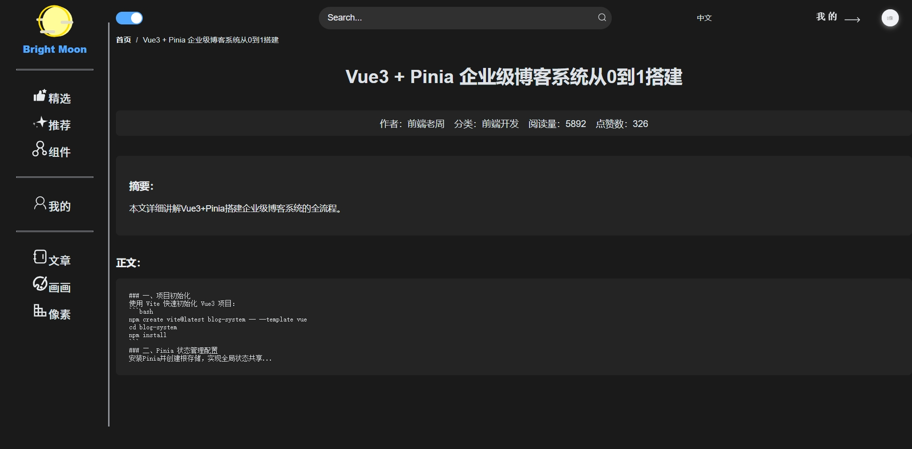

# BrightMoon ✨

一款力求工程化高、交互体验优、前端需求全面的前端项目，基于Vue3 + Vite + Element Plus开发，目前集成性能优化、实时交互、权限控制、丰富动效等核心能力。



# 🚀 核心亮点

**基础体验优化**：完成9项核心基础功能开发，含页面加载骨架屏、路由切换过渡动画、全局加载遮罩、404/500错误页面定制、空状态组件、回到顶部按钮、面包屑导航、动态页面标题及暗黑模式切换，显著提升用户交互流畅度与视觉体验，减少页面等待感与生硬切换感

**表单与交互增强**：实现表单一键重置、富文本编辑器集成、表单提交防抖、确认框封装等核心功能，封装防抖/节流工具函数及自定义指令，开发弹窗拖拽、组件拖拽排序、自定义右键菜单、新手引导页等交互功能，优化高频操作体验，避免重复请求与误操作

**权限与安全体系搭建**：构建完整的前后端权限控制体系，实现路由权限动态过滤、按钮级权限控制、接口权限校验与Token过期预留刷新逻辑，落地登录状态持久化、防XSS攻击、接口请求加密、密码强度校验等安全功能，保障系统数据安全与访问规范

**性能优化落地**：实施多重性能优化策略，包括路由与组件懒加载、图片懒加载、频繁请求数据缓存、UI组件按需引入、关键资源预加载、响应式数据优化及无用事件解绑，集成打包体积分析工具，有效减小首屏加载体积，提升页面加载速度与渲染性能

**工程化与开发效率提升**：搭建标准化前端工程化体系，完成接口请求统一封装、全局常量管理、通用工具函数封装，集成ESLint+Prettier代码规范校验、Husky提交规范校验、环境变量隔离、组件自动注册、错误边界及Mock数据模拟功能，统一开发规范，减少重复代码，提升团队协作与开发效率

**错误处理与扩展功能**：实现全局错误捕获、接口错误统一处理、接口超时处理及性能监控功能，保障系统稳定运行；TOTP二次验证预留对接等扩展功能，为后续功能迭代奠定基础

# ⚡ 快速上手

## 1、克隆项目

```
git clone https://github.com/zhuming2787/BrightMoon.git
cd BrightMoon
```

## 2、安装依赖

推荐使用pnpm（速度更快）

```
# 安装依赖
pnpm install
```

## 3、运行项目

```
npm run dev
```

## 4、打包部署

```
npm run build
```

打包产物在dist/目录，可部署

# 🤝 如何贡献？

## 贡献步骤

1、提Issue：在 Issues 中提出需求 / 问题，确认开发方向

2、Fork 仓库：点击右上角 Fork 到自己的账号

3、创建分支：基于 main 分支创建，命名规则：feat/功能名/fix/BUG名/docs/文档名

4、提交 PR：完成开发后，向本仓库 main 分支提交 Pull Request，附修改说明

## 规范要求

1、Commit 格式：type(scope): description，例：feat(comment): 新增评论点赞动效

2、代码风格：遵循 ESLint+Prettier 配置，提交前会自动检测ESLint规范

3、文档同步：修改功能 / 配置后，同步更新 README.md 或相关说明

# 📄 开源协议

本项目基于 MIT 协议 开源，可自由使用、修改、分发，只需保留版权声明。详情见 LICENSE。

# 📞 联系我

- 邮箱 : 2787342250@qq.com

> 感谢每一位贡献者的付出，让我们一起把这个项目做得更好！💪
